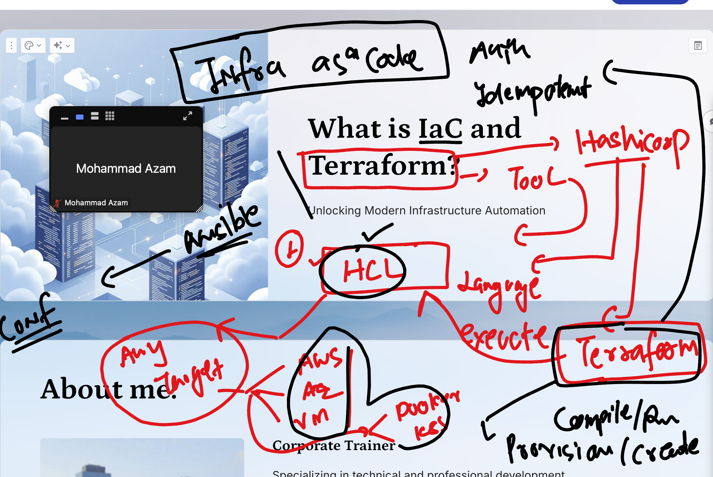
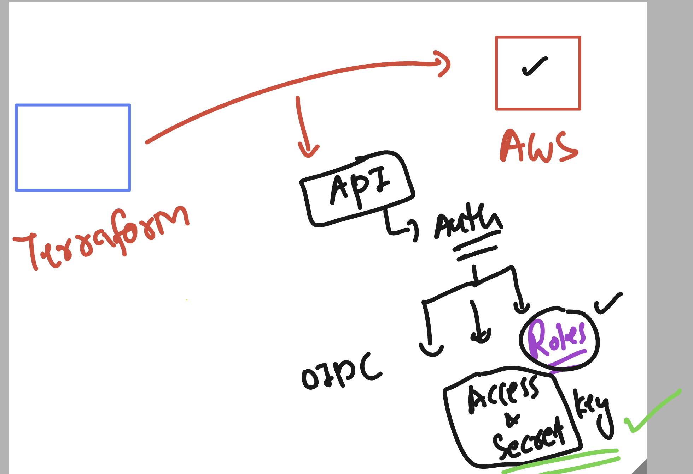
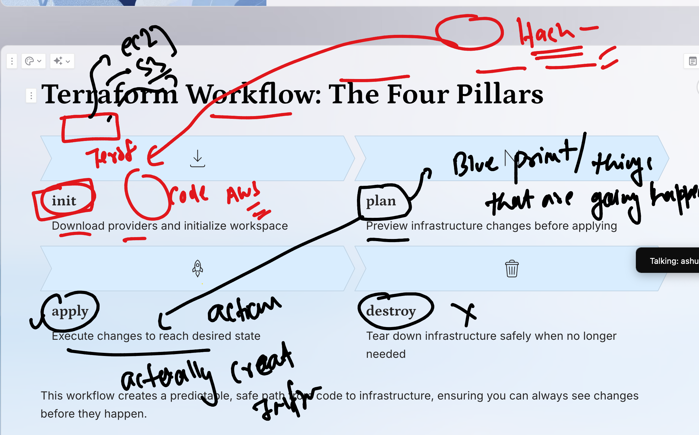
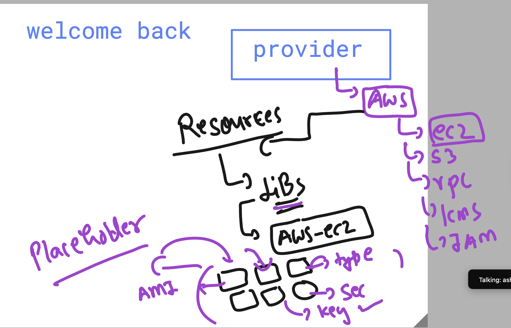

# terraform_aws_cicd25thAug2025

## Understanding in Infra planning problem with Tradditional approach 


### Introduction to Terraform / HCP  by hashiCorp 




### checking terraform version 

```
terraform  version 
Terraform v1.13.0
on linux_amd64

```

### configure vscode webui in linux 


```
[ashu@ip-172-31-41-146 ~]$ code-server 
[2025-08-25T04:27:58.860Z] info  Wrote default config file to /home/ashu/.config/code-server/config.yaml
[2025-08-25T04:27:59.093Z] info  code-server 4.103.1 fbaadbcfbc16401327e28bd5df3040261977a540
[2025-08-25T04:27:59.098Z] info  Using user-data-dir /home/ashu/.local/share/code-server
[2025-08-25T04:27:59.107Z] error listen EADDRINUSE: address already in use 127.0.0.1:8080
[ashu@ip-172-31-41-146 ~]$ 
[ashu@ip-172-31-41-146 ~]$ 
[ashu@ip-172-31-41-146 ~]$ nano    /home/ashu/.config/code-server/config.yaml 
[ashu@ip-172-31-41-146 ~]$ nano    /home/ashu/.config/code-server/config.yaml 
[ashu@ip-172-31-41-146 ~]$ cat  /home/ashu/.config/code-server/config.yaml
bind-addr: 0.0.0.1:8081
auth: password
password: 
cert: false

```

### from terraform machine configure auth to aws creds

```
ec2-user@ip-172-31-41-146 ashu-codes]$ aws configure 
AWS Access Key ID [****************OPVA]: 
AWS Secret Access Key [****************c6B+]: 
Default region name [ap-south-1]: us-east-1
Default output format [None]: 
[ec2-user@ip-172-31-41-146 ashu-codes]$ 

```

### terraform machine connecting to aws 



## Terrform workflows --> INit 

```
ec2-user@ip-172-31-41-146 ashu-codes]$ ls
provider.tf

[ec2-user@ip-172-31-41-146 ashu-codes]$ terraform  init 
Initializing the backend...
Initializing provider plugins...
- Finding hashicorp/aws versions matching "6.10.0"...
- Installing hashicorp/aws v6.10.0...
- Installed hashicorp/aws v6.10.0 (signed by HashiCorp)
Terraform has created a lock file .terraform.lock.hcl to record the provider
selections it made above. Include this file in your version control repository
so that Terraform can guarantee to make the same selections by default when
you run "terraform init" in the future.

```

### Terraform 4 pillors



### Understanding Resources under provider 



### to create simple ec2 machine 

```
terraform init 
==>
terraform  plan

Terraform used the selected providers to generate the following execution plan. Resource actions are indicated with the following symbols:
  + create

Terraform will perform the following actions:

  # aws_instance.ashu-name will be created
  + resource "aws_instance" "ashu-name" {
      + ami                                  = "ami-0b016c703b95ecbe4"
      + arn                                  = (known after apply)
      + associate_public_ip_address          = (known after apply)
      + availability_zone                    = (known after apply)
      + disable_api_stop                     = (known after apply)

====>

 terraform  apply 

Terraform used the selected providers to generate the following execution plan. Resource actions are indicated with the following symbols:
  + create

Terraform will perform the following actions:

  # aws_instance.ashu-name will be created
  + resource "aws_instance" "ashu-name" {
      + ami                                  = "ami-0b016c703b95ecbe4"
      + arn                                  = (known after apply)
      + associate_public_ip_address          = (known after apply)
      + availability_zone                    = (known after apply)
```