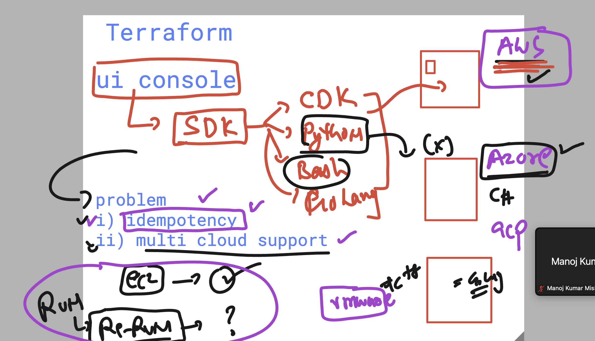

# terraform_aws_cicd25thAug2025

## Understanding in Infra planning problem with Tradditional approach 




### Introduction to Terraform / HCP  by hashiCorp 


### checking terraform version 

```
terraform  version 
Terraform v1.13.0
on linux_amd64

```

### configure vscode webui in linux 


```
[ashu@ip-172-31-41-146 ~]$ code-server 
[2025-08-25T04:27:58.860Z] info  Wrote default config file to /home/ashu/.config/code-server/config.yaml
[2025-08-25T04:27:59.093Z] info  code-server 4.103.1 fbaadbcfbc16401327e28bd5df3040261977a540
[2025-08-25T04:27:59.098Z] info  Using user-data-dir /home/ashu/.local/share/code-server
[2025-08-25T04:27:59.107Z] error listen EADDRINUSE: address already in use 127.0.0.1:8080
[ashu@ip-172-31-41-146 ~]$ 
[ashu@ip-172-31-41-146 ~]$ 
[ashu@ip-172-31-41-146 ~]$ nano    /home/ashu/.config/code-server/config.yaml 
[ashu@ip-172-31-41-146 ~]$ nano    /home/ashu/.config/code-server/config.yaml 
[ashu@ip-172-31-41-146 ~]$ cat  /home/ashu/.config/code-server/config.yaml
bind-addr: 0.0.0.1:8081
auth: password
password: 
cert: false

```

### from terraform machine configure auth to aws creds

```
ec2-user@ip-172-31-41-146 ashu-codes]$ aws configure 
AWS Access Key ID [****************OPVA]: 
AWS Secret Access Key [****************c6B+]: 
Default region name [ap-south-1]: us-east-1
Default output format [None]: 
[ec2-user@ip-172-31-41-146 ashu-codes]$ 

```