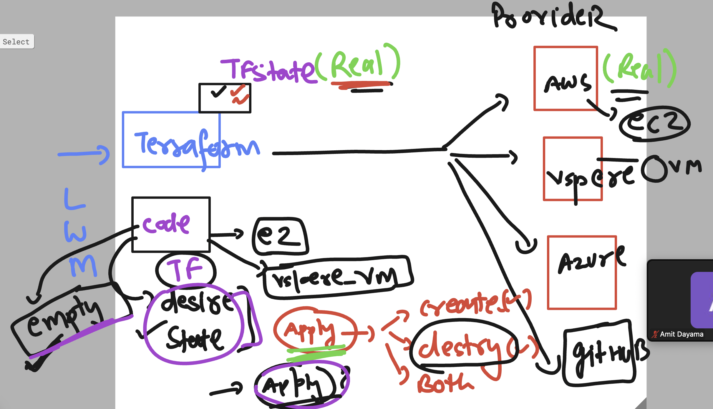
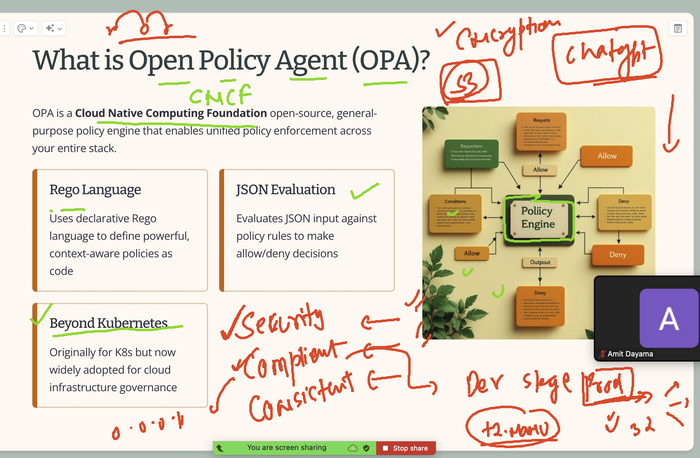
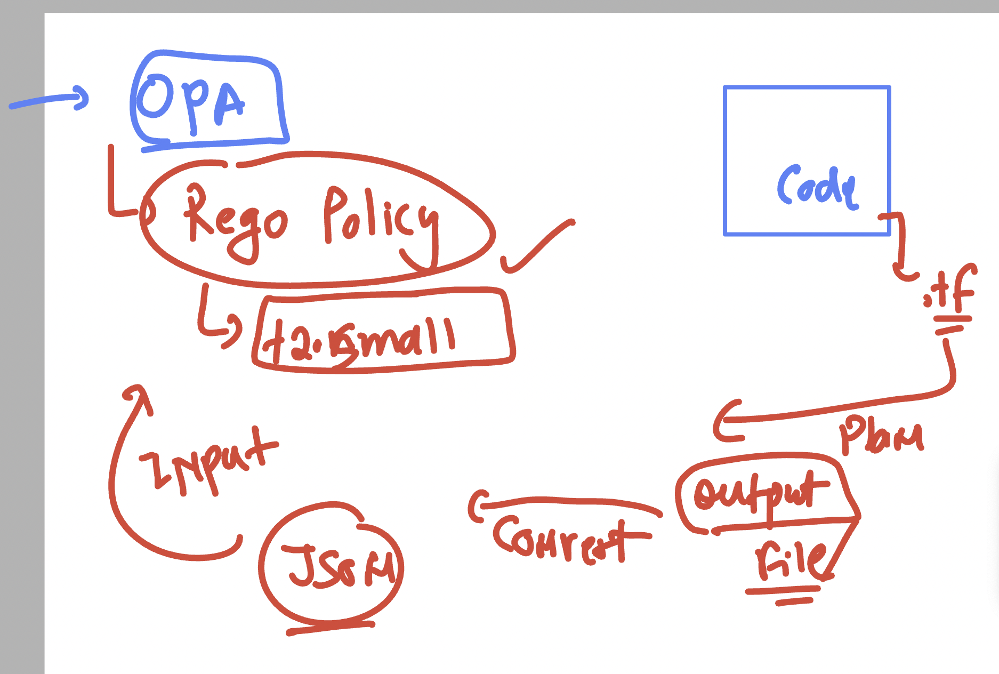
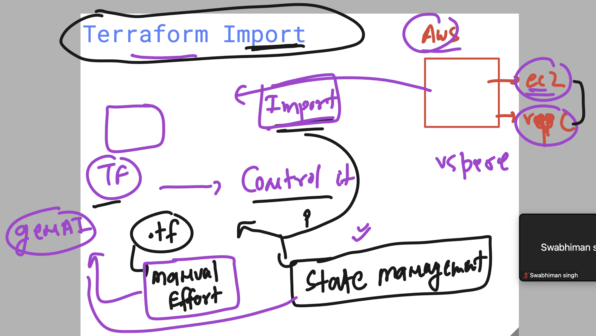
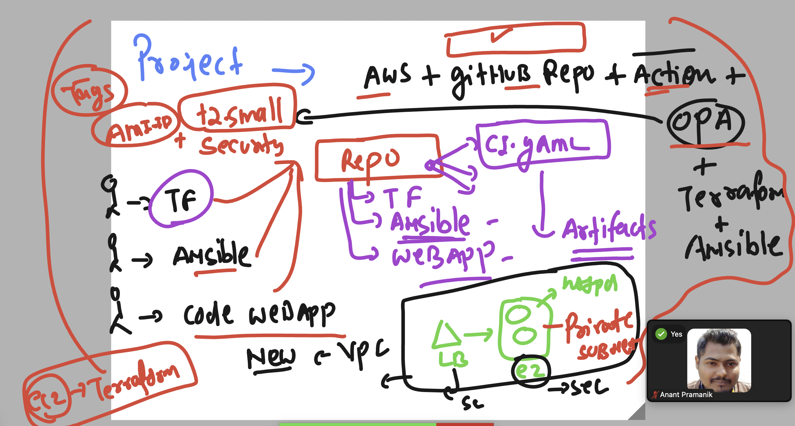

# terraform_aws_cicd25thAug2025

### Terraform desire state vs current state 



### OPA 



## OPA installation in your current platform 

[click_here](https://sangkeon.github.io/opaguide/chap2/installandusage.html)

## OPA demo example 

### POlicy 1 

```
package hello

default message  = "Hello, world"

```

### query the policy with opa CLI

```
opa eval --data  example1.rego  "data.hello.message"
{
  "result": [
    {
      "expressions": [
        {
          "value": "Hello, world",
          "text": "data.hello.message",
          "location": {
            "row": 1,
            "col": 1
          }
        }
      ]
    }
  ]
}
```

## Demo with terraform understanding OPA 




## Demo 

```
terrform init

terraform plan -out=tfplan.binary

 ls
main.tf  tfplan.binary

## convert to json 

terraform show -json tfplan.binary  >tfplan.json 
[ec2-user@ip-172-31-41-146 ec2]$ ls
main.tf  tfplan.binary  tfplan.json
[ec2-user@ip-172-31-41-146 ec2]$ 

```


### using opa to validate the code 

```
 opa eval --data  ec2.rego  --input tfplan.json "data.terraform.deny"
{
  "result": [
    {
      "expressions": [
        {
          "value": {
            "EC2 instance name must not use disallowed type t2.small": true
          },
          "text": "data.terraform.deny",
          "location": {
            "row": 1,
            "col": 1
          }
        }
      ]
    }
  ]
}

```

### doing the same with  s3 with opa + terraform 

```
185  terraform init 
 1186  ls
 1187  terraform plan -out=tfplan.binary 
 1188  ls
 1189  terraform show -json tfplan.binary  >tfplan.json 
 1190  ls
 1191  t
 1192  opa eval --data s3.rego   --input tfplan.json  "data.terraform.deny"

 ```

 ## terraform import understanding 

 

 ### demo with vpc import 

 ```
 mkdir  vpc_import
[ec2-user@ip-172-31-41-146 day10-final]$ touch vpc_import/main.tf
[ec2-user@ip-172-31-41-146 day10-final]$ 

```

###  Project basic understanding 



