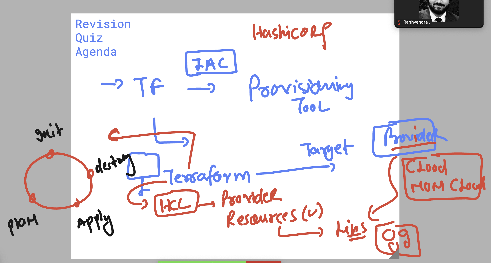
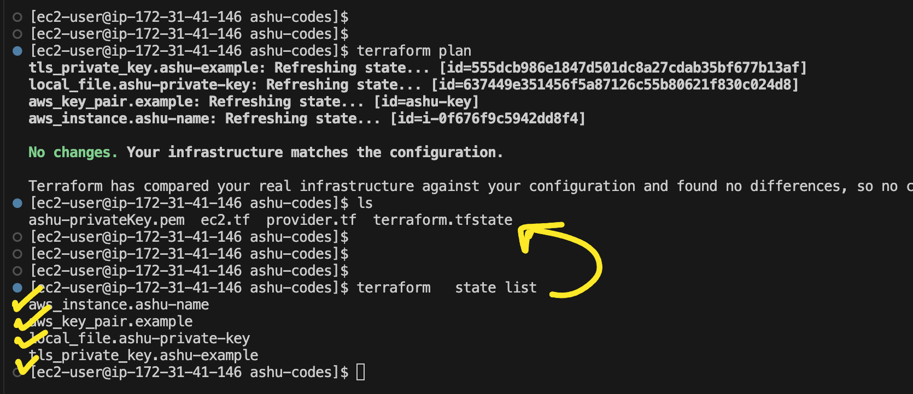

# terraform_aws_cicd25thAug2025

### Revision



## Removing all Terraform internals

```shell
$ ls
ec2.tf  provider.tf  terraform.tfstate  terraform.tfstate.backup

$ ls terraform.tfstate*
terraform.tfstate  terraform.tfstate.backup

$ rm terraform.tfstate*

$ ls
ec2.tf  provider.tf

$ ls -a
.  ..  .terraform  .terraform.lock.hcl  ec2.tf  provider.tf

$ rm -rf .terraform*

$ ls
ec2.tf  provider.tf

$ ls -a
.  ..  ec2.tf  provider.tf
```

### Understanding `terraform init`

```shell
$ terraform init
Initializing the backend...
Initializing provider plugins...
- Finding latest version of hashicorp/tls...
- Finding hashicorp/aws versions matching "6.10.0"...
- Finding latest version of hashicorp/local...
- Installing hashicorp/aws v6.10.0...
- Installed hashicorp/aws v6.10.0 (signed by HashiCorp)
- Installing hashicorp/local v2.5.3...
- Installed hashicorp/local v2.5.3 (signed by HashiCorp)
- Installing hashicorp/tls v4.1.0...
- Installed hashicorp/tls v4.1.0 (signed by HashiCorp)

Terraform has created a lock file .terraform.lock.hcl to record the provider
selections it made above. Include this file in your version control repository
so that Terraform can guarantee to make the same selections by default when
you run "terraform init" in the future.

Terraform has been successfully initialized!

You may now begin working with Terraform. Try running "terraform plan" to see
any changes that are required for your infrastructure. All Terraform commands
should now work.

If you ever set or change modules or backend configuration for Terraform,
rerun this command to reinitialize your working directory. If you forget, other
commands will detect it and remind you to do so if necessary.

$ ls -a
.  ..  .terraform  .terraform.lock.hcl  ec2.tf  provider.tf

$ ls .terraform
providers

$ ls .terraform/providers/
registry.terraform.io

$ ls .terraform/providers/registry.terraform.io/
hashicorp

$ ls .terraform/providers/registry.terraform.io/hashicorp/
aws  local  tls

$ ls .terraform/providers/registry.terraform.io/hashicorp/tls/
4.1.0

$ ls .terraform/providers/registry.terraform.io/hashicorp/tls/4.1.0/
linux_amd64

$ ls .terraform/providers/registry.terraform.io/hashicorp/tls/4.1.0/linux_amd64/
LICENSE.txt  terraform-provider-tls_v4.1.0_x5
```

```shell
$ terraform init --upgrade
Initializing the backend...
Initializing provider plugins...
- Finding latest version of hashicorp/local...
- Finding latest version of hashicorp/tls...
- Finding hashicorp/aws versions matching "6.10.0"...
- Using previously-installed hashicorp/aws v6.10.0
- Using previously-installed hashicorp/local v2.5.3
- Using previously-installed hashicorp/tls v4.1.0
```

## Understanding terraform tfstate file 



### dealing with terraform state options 

```
ec2-user@ip-172-31-41-146 ashu-codes]$ terraform state list
aws_instance.ashu-name
aws_key_pair.example
local_file.ashu-private-key
tls_private_key.ashu-example
[ec2-user@ip-172-31-41-146 ashu-codes]$ terraform state  show  aws_instance.ashu-name
# aws_instance.ashu-name:
resource "aws_instance" "ashu-name" {
    ami                                  = "ami-0b016c703b95ecbe4"
    arn                                  = "arn:aws:ec2:us-east-2:992382386705:instance/i-0f676f9c5942dd8f4"
    associate_public_ip_address          = true
    availability_zone                    = "us-east-2b"
    disable_api_stop                     = false
    disable_api_termination              = false
    ebs_optimized                        = false

```
### more terraform commands 

```
384  terraform plan 
  385  terraform state list
  386  terraform state  show  aws_instance.ashu-name
  387  terraform state list
  388  terraform  plan  -target=aws_key_pair.example
  389  terraform apply   -target=aws_key_pair.example
  390  terraform destroy   -target=aws_key_pair.example
```