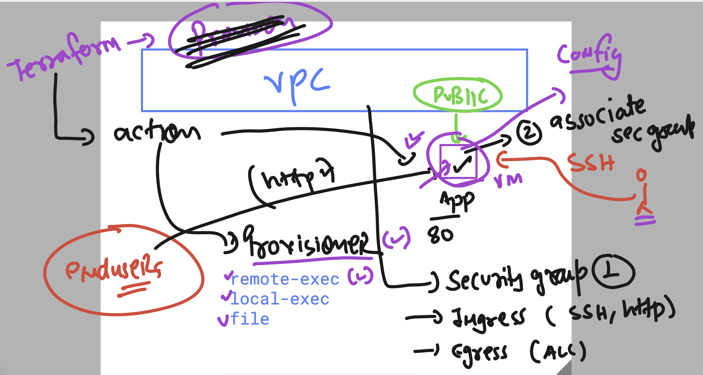

# terraform_aws_cicd25thAug2025

```
814  terraform apply --auto-approve 
  815  terraform  state list 
  816  history 
[ec2-user@ip-172-31-41-146 ashu-vpc]$ 
[ec2-user@ip-172-31-41-146 ashu-vpc]$ 
[ec2-user@ip-172-31-41-146 ashu-vpc]$ terraform  state list 
aws_internet_gateway.example
aws_route_table.example
aws_subnet.private_example
aws_subnet.public_example
aws_vpc.example

```

## Creating and associating security group in new vpc -vm 


## updates in security group aws terraform docs 


## provisioner in terraform 



### destroying only single resource 

```
[ec2-user@ip-172-31-41-146 ashu-vpc]$ terraform state list 
aws_eip.example
aws_instance.example
aws_internet_gateway.example
aws_key_pair.example
aws_nat_gateway.example
aws_route_table.example
aws_route_table.example-private
aws_route_table_association.example
aws_route_table_association.example-private
aws_security_group.example
aws_subnet.private_example
aws_subnet.public_example
aws_vpc.example
aws_vpc_security_group_egress_rule.example-all-ipv4
aws_vpc_security_group_egress_rule.example-allipv6
aws_vpc_security_group_ingress_rule.example-ssh
local_file.ashu-private-key
tls_private_key.example
[ec2-user@ip-172-31-41-146 ashu-vpc]$ 
[ec2-user@ip-172-31-41-146 ashu-vpc]$ terraform destroy -target=aws_instance.example
tls_private_key.example: Refreshing state... [id=9230fb1c77d1dddc3981a4a0ee0e3d24795fb728]
aws_key_pair.example: Refreshing state... [id=ashu-new-vpc-vm-key]
aws_vpc.example: Refreshing state... [id=vpc-04313cf7c7324165d]
aws_security_group.example: Refreshing state... [id=sg-0f9ad839f19ca660e]
aws_subnet.public_example: Refreshing state... [id=subnet-07f3f0d957cfc7063]
aws_instance.example: Refreshing state... [id=i-04891fc69dd0e5962]

Terraform used the selected providers to generate the following execution plan. Resource actions are indicated with the following symbols:
  - destroy

Terraform will perform the following actions:

  # aws_instance.example will be destroyed

```