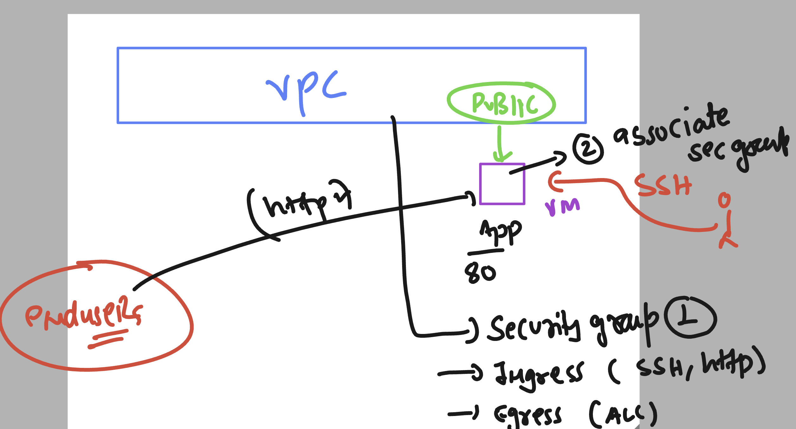
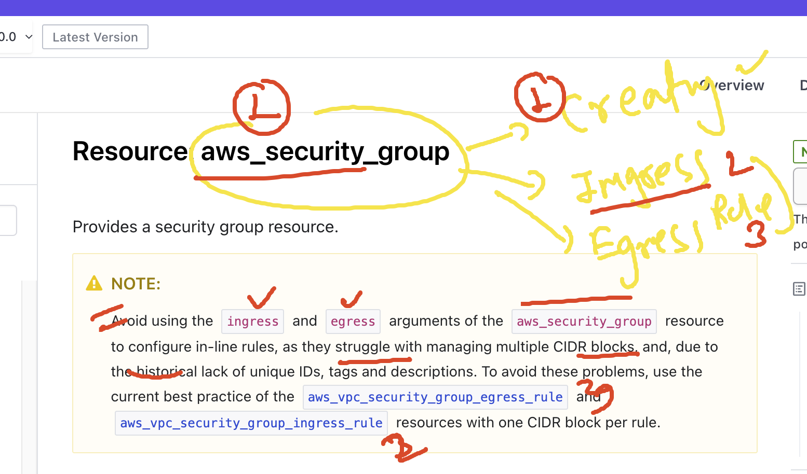

# terraform_aws_cicd25thAug2025

```
814  terraform apply --auto-approve 
  815  terraform  state list 
  816  history 
[ec2-user@ip-172-31-41-146 ashu-vpc]$ 
[ec2-user@ip-172-31-41-146 ashu-vpc]$ 
[ec2-user@ip-172-31-41-146 ashu-vpc]$ terraform  state list 
aws_internet_gateway.example
aws_route_table.example
aws_subnet.private_example
aws_subnet.public_example
aws_vpc.example

```

## Creating and associating security group in new vpc -vm 



## updates in security group aws terraform docs 

