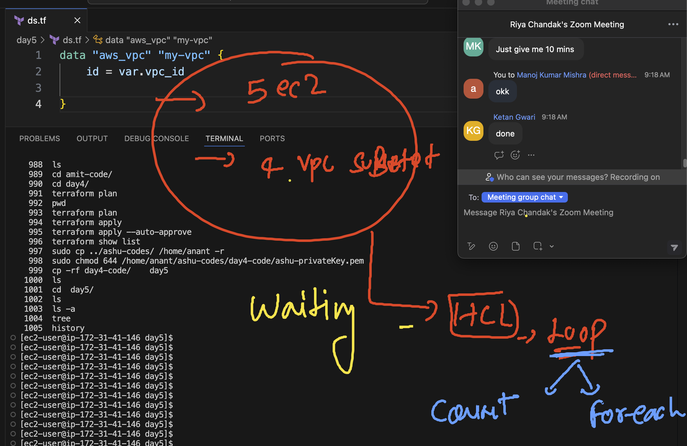

## Revision 

### terraform 1 


### terraform  refresh understanding 


## Extending same code 

```
cp -rf day4-code/    day5
```
### verify your day5 

```
[ec2-user@ip-172-31-41-146 ashu-codes]$ cd  day5/
[ec2-user@ip-172-31-41-146 day5]$ 
[ec2-user@ip-172-31-41-146 day5]$ ls
ds.tf  ec2.tf  html-sample-app  main.tf  output.tf  provider.tf  terraform.tfvars  variables.tf
[ec2-user@ip-172-31-41-146 day5]$ ls -a
.  ..  ds.tf  ec2.tf  html-sample-app  main.tf  output.tf  provider.tf  terraform.tfvars  variables.tf
[ec2-user@ip-172-31-41-146 day5]$ tree 

```

## understanding loop in HCL 



## tip for formatting terraform code 

```
[ec2-user@ip-172-31-41-146 day5]$ terraform fmt 
ds.tf
ec2.tf
output.tf
provider.tf
terraform.tfvars
variables.tf
[ec2-user@ip-172-31-41-146 day5]$ terraform fmt 
ec2.tf
[ec2-user@ip-172-31-41-146 day5]$ 

```


## using for_each 

```
# ami ids 
variable "my_instances" {
  default = {
    ashu-vm1 = "ami-0b016c703b95ecbe4"
    ashu-vm2 = "ami-0f70b01eb0d5c5caa"
  }
  
}

# creating ec2 
resource "aws_instance" "example2" {
  for_each = var.my_instances
  ami = each.value
  instance_type = "t2.nano"
  tags = {
    Name = each.key
  }
  
}

```

### some commands 

```
 1013  terraform apply --auto-approve 
 1014  terraform  state list 
 1015  terraform  apply 
 1016  terraform  output 
 1017  terraform state list
 1018  terraform  output 
 1019  terraform  apply --auto-approve
 1020  terraform destroy --auto-approve
 1021  terraform  apply -target=aws_instance.example2 
 1022  terraform  destroy --auto-approve  -target=aws_instance.example2 
 1023  history 

 ```