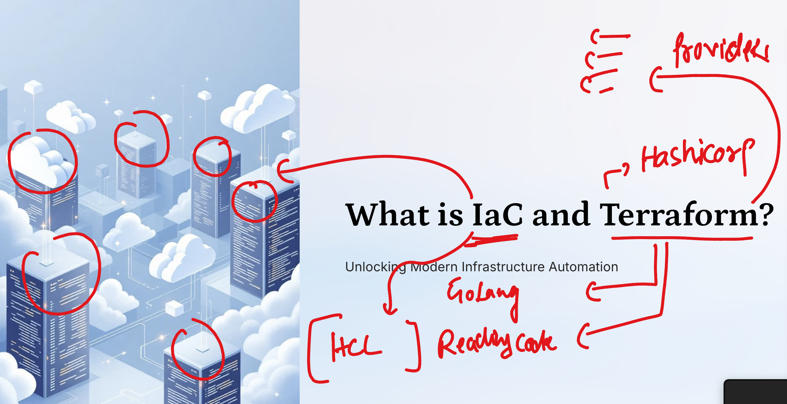
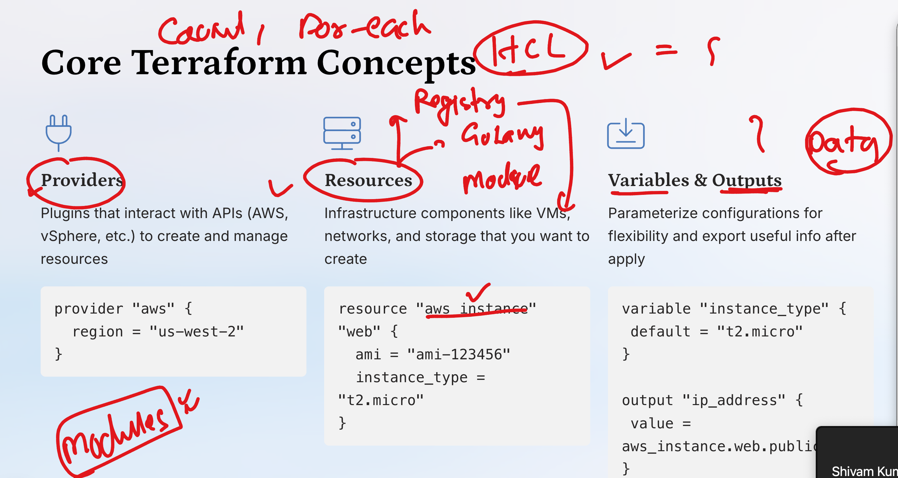
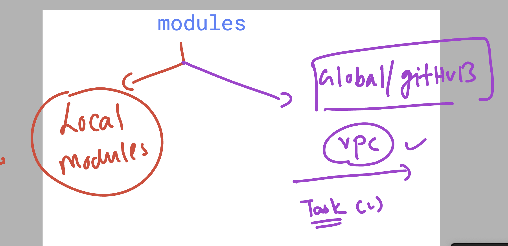
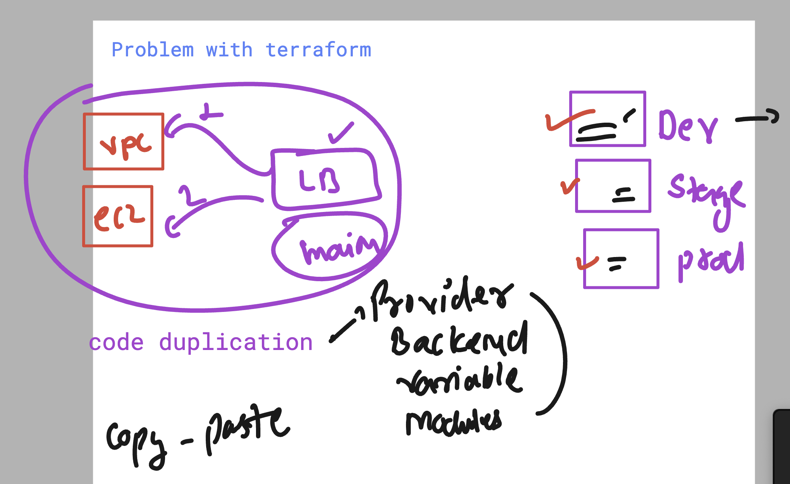
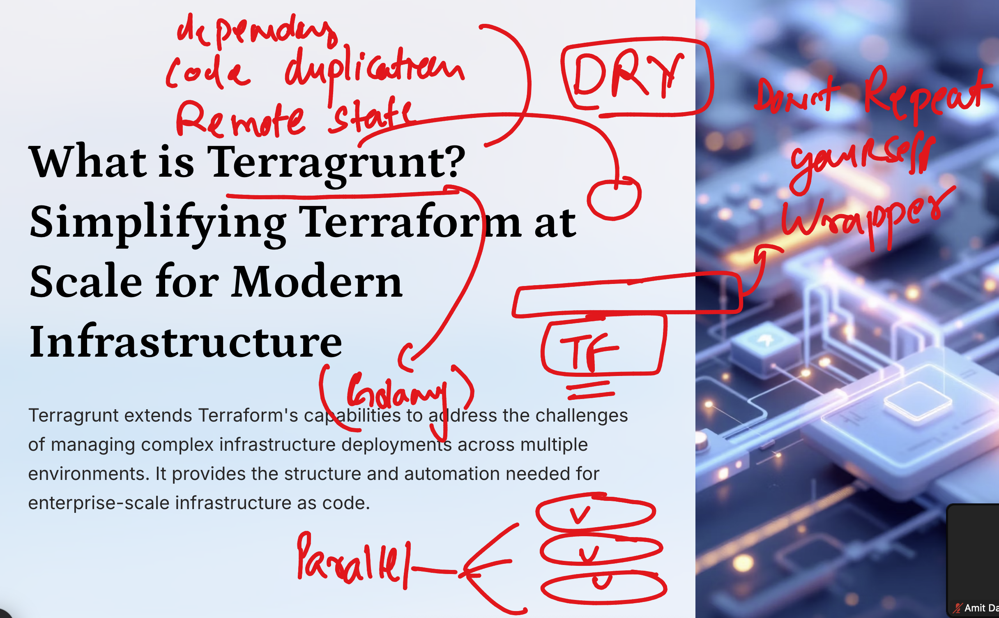
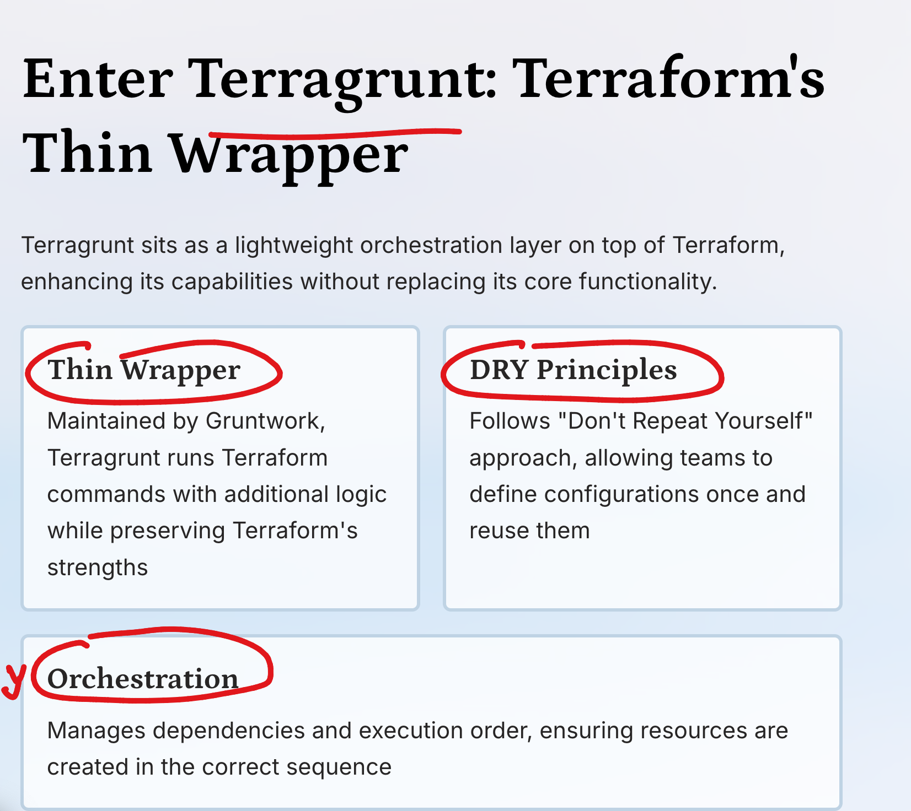
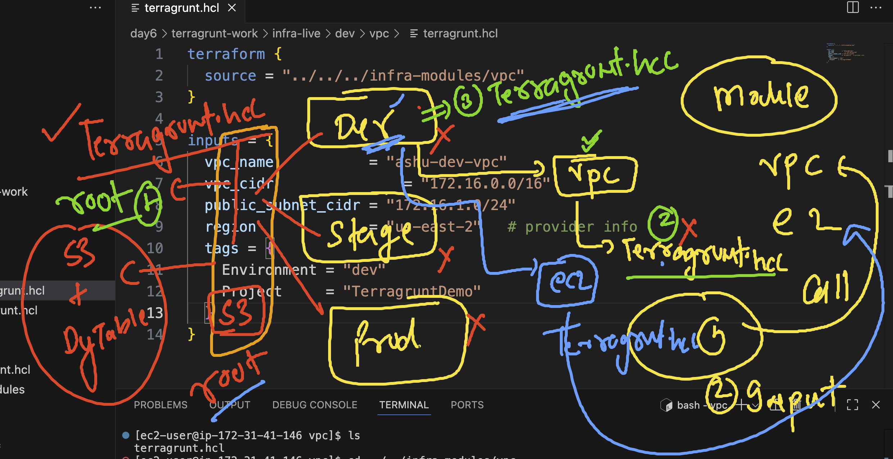

## Getting started with Revision 

## Revision 1 



## Revision 2




## Dealing with Modules in terraform 

### Creating directory structure for modules 

```
[ec2-user@ip-172-31-41-146 ashu-codes]$ mkdir day6
[ec2-user@ip-172-31-41-146 ashu-codes]$ mkdir day6/modules
[ec2-user@ip-172-31-41-146 ashu-codes]$ mkdir day6/modules/vpc
[ec2-user@ip-172-31-41-146 ashu-codes]$ mkdir day6/modules/s3
[ec2-user@ip-172-31-41-146 ashu-codes]$ tree  day6/
day6/
└── modules
    ├── s3
    └── vpc

3 directories, 0 files

```
### final directory structure 

```
 tree  day6/
day6/
├── modules
│   ├── s3
│   └── vpc
└── use_modules
    └── ec2

```

### Terraform modules type 



### problem with terraform in case of huge projects or Multi env cases



## basic intro about Terragrunt



## some advantages of terrgrunt 



### checking terragrunt version 

```
ec2-user@ip-172-31-41-146 use_modules]$ terragrunt  run --version 
terragrunt version v0.86.1
[ec2-user@ip-172-31-41-146 use_modules]$ 

```

## lets start implementing multi environment  directory structure 

```
mkdir  terragrunt-work
[ec2-user@ip-172-31-41-146 day6]$ cd terragrunt-work/
[ec2-user@ip-172-31-41-146 terragrunt-work]$ ls
[ec2-user@ip-172-31-41-146 terragrunt-work]$ 
[ec2-user@ip-172-31-41-146 terragrunt-work]$ 
[ec2-user@ip-172-31-41-146 terragrunt-work]$ mkdir  infra-modules  infra-live 
[ec2-user@ip-172-31-41-146 terragrunt-work]$ tree .
.
├── infra-live
└── infra-modules

2 directories, 0 files
[ec2-user@ip-172-31-41-146 terragrunt-work]$ mkdir  infra-modules/{ec2,vpc}
[ec2-user@ip-172-31-41-146 terragrunt-work]$ tree .
.
├── infra-live
└── infra-modules
    ├── ec2
    └── vpc

4 directories, 0 files
[ec2-user@ip-172-31-41-146 terragrunt-work]$ mkdir  infra-live/{dev,stage,prod}
[ec2-user@ip-172-31-41-146 terragrunt-work]$ tree .
.
├── infra-live
│   ├── dev
│   ├── prod
│   └── stage
└── infra-modules
    ├── ec2
    └── vpc
```

## terragrunt.hcl  in -- the location of infra-live/dev 

```
# Inherit root settings (remote_state, etc.)
include {
  path = find_in_parent_folders()
}

# Environment-specific locals
locals {
  aws_region  = "us-east-2"
  environment = "dev"
}

# Pass provider info to modules
inputs = {
  region = local.aws_region
  Env    = local.environment
}

```

### terragrunt.hcl  in the location of infra-live/dev/vpc

```

terraform {
  source = "../../../infra-modules/vpc"
}

inputs = {
  vpc_name           = "ashu-dev-vpc"
  vpc_cidr               = "10.0.0.0/16"
  public_subnet_cidr = "10.0.1.0/24"
  region             = "ap-south-1"   # provider info
  tags = {
    Environment = "dev"
    Project     = "TerragruntDemo"
  }
}
```

## understanding role and usage of terragrunt.hcl file 



