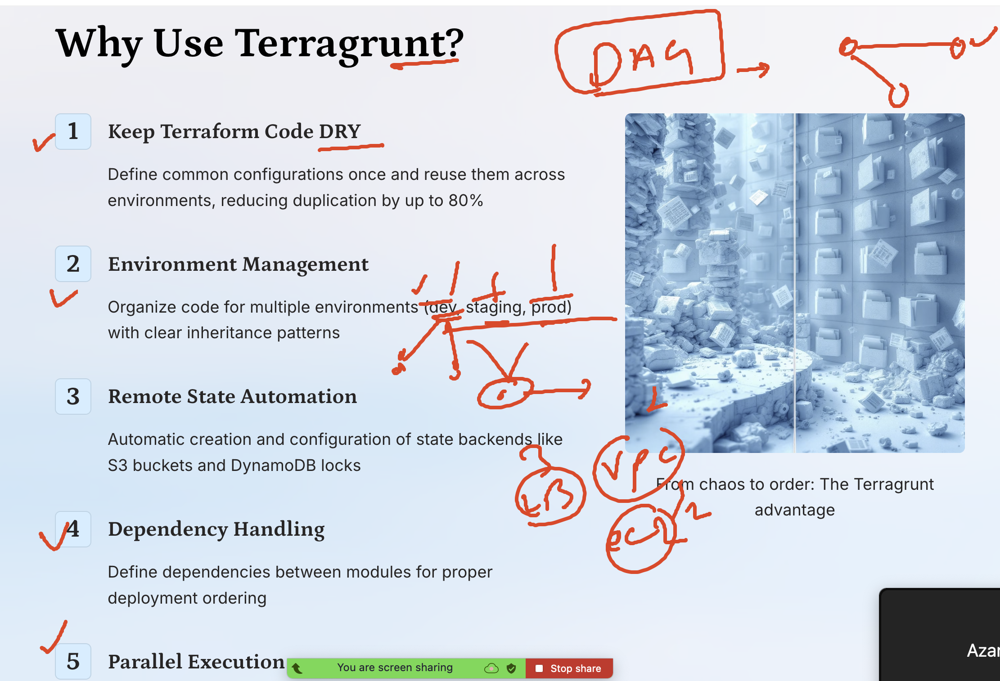

# terraform_aws_cicd25thAug2025

### Revision about Terragrunt 



## creating directory structure and using it with terragrunt 

```
mkdir  day7-terragrunt
ls day7-terragrunt/
root.hcl

===root.hcl content 

# Root Terragrunt: global settings like remote state
remote_state {
  backend = "s3"
  config = {
    bucket         = "ashubackstores111"
    key            = "${path_relative_to_include()}/terraform.tfstate"
    region         = "ap-south-1"
    dynamodb_table = "ashu-lock-table1"
    encrypt        = true
  }
}

# Optional: global locals
locals {
  company = "ashu-inc"
}

```

### few changes 

```
 
[ec2-user@ip-172-31-41-146 ashu-codes]$ cd day7-terragrunt/
[ec2-user@ip-172-31-41-146 day7-terragrunt]$ ls
root.hcl
[ec2-user@ip-172-31-41-146 day7-terragrunt]$ 
[ec2-user@ip-172-31-41-146 day7-terragrunt]$ 
[ec2-user@ip-172-31-41-146 day7-terragrunt]$ mkdir  infra-module infra-live
[ec2-user@ip-172-31-41-146 day7-terragrunt]$ ls
infra-live  infra-module  root.hcl
[ec2-user@ip-172-31-41-146 day7-terragrunt]$ 
[ec2-user@ip-172-31-41-146 day7-terragrunt]$ mv root.hcl   infra-live/
[ec2-user@ip-172-31-41-146 day7-terragrunt]$ ls
infra-live  infra-module
[ec2-user@ip-172-31-41-146 day7-terragrunt]$ ls  infra-live/
root.hcl
[ec2-user@ip-172-31-41-146 day7-terragrunt]$ 

```
### creating module directory 

```
mkdir  infra-module/vpc
[ec2-user@ip-172-31-41-146 day7-terragrunt]$ mkdir  infra-module/ec2
[ec2-user@ip-172-31-41-146 day7-terragrunt]$ touch infra-module/vpc/main.tf
[ec2-user@ip-172-31-41-146 day7-terragrunt]$ touch infra-module/ec2/main.tf
[ec2-user@ip-172-31-41-146 day7-terragrunt]$ 

```
### vpc/main.tf

```
terraform {
  backend "s3" {}
  required_providers {
    aws = {
      source  = "hashicorp/aws"
      version = "~> 5.0"
    }
  }
}

variable "vpc_cidr" {
  type        = string
  description = "CIDR block for the VPC"
}

variable "public_subnet_cidr" {
  type        = string
  description = "CIDR block for the public subnet"
}

variable "region" {
  type        = string
  description = "AWS region"
}

provider "aws" {
  region = var.region
}

# VPC
resource "aws_vpc" "this" {
  cidr_block           = var.vpc_cidr
  enable_dns_support   = true
  enable_dns_hostnames = true
  tags = {
    Name = "demo-vpc"
  }
}

# Internet Gateway
resource "aws_internet_gateway" "this" {
  vpc_id = aws_vpc.this.id
  tags = {
    Name = "demo-igw"
  }
}

# Public Subnet
resource "aws_subnet" "public" {
  vpc_id                  = aws_vpc.this.id
  cidr_block              = var.public_subnet_cidr
  map_public_ip_on_launch = true
  availability_zone       = "${var.region}a"

  tags = {
    Name = "demo-public-subnet"
  }
}

# Route Table for Public Subnet
resource "aws_route_table" "public" {
  vpc_id = aws_vpc.this.id

  route {
    cidr_block = "0.0.0.0/0"
    gateway_id = aws_internet_gateway.this.id
  }

  tags = {
    Name = "demo-public-rt"
  }
}

# Route Table Association
resource "aws_route_table_association" "public_assoc" {
  subnet_id      = aws_subnet.public.id
  route_table_id = aws_route_table.public.id
}

# Outputs
output "vpc_id" {
  value = aws_vpc.this.id
}

output "public_subnet_id" {
  value = aws_subnet.public.id
}

```

## ec2/main.tf

```
terraform {
  backend "s3" {}
  required_providers {
    aws = {
      source  = "hashicorp/aws"
      version = ">= 5.0"
    }
  }
}
provider "aws" {
  region = var.region
  
}

# NOTE: No provider block here — let root/Terragrunt set the AWS provider/region.

# Security Group allowing SSH (22) and HTTP (80)
resource "aws_security_group" "this" {
  name        = "${var.name}-sg"
  description = "Allow SSH and HTTP"
  vpc_id      = var.vpc_id

  ingress {
    description = "SSH"
    from_port   = 22
    to_port     = 22
    protocol    = "tcp"
    cidr_blocks = ["0.0.0.0/0"]
  }

  ingress {
    description = "HTTP"
    from_port   = 80
    to_port     = 80
    protocol    = "tcp"
    cidr_blocks = ["0.0.0.0/0"]
  }

  egress {
    from_port   = 0
    to_port     = 0
    protocol    = "-1"
    cidr_blocks = ["0.0.0.0/0"]
  }

  tags = merge(var.tags, { Name = "${var.name}-sg" })
}

# Single EC2 instance in the provided public subnet
resource "aws_instance" "this" {
  ami                         = var.ami_id
  instance_type               = var.instance_type
  subnet_id                   = var.subnet_id
  vpc_security_group_ids      = [aws_security_group.this.id]
  associate_public_ip_address = true

  # Optional: uncomment if you want user data
  # user_data = var.user_data

  tags = merge(var.tags, { Name = "${var.name}-ec2" })
}

variable "name" {
  description = "Name prefix for resources"
  type        = string
  default     = "demo"
}

variable "region" {
  type = string
  
}

variable "vpc_id" {
  description = "VPC ID where the SG will be created"
  type        = string
}

variable "subnet_id" {
  description = "Public subnet ID where the instance will be launched"
  type        = string
}

variable "ami_id" {
  description = "AMI ID for the instance"
  type        = string
}

variable "instance_type" {
  description = "EC2 instance type"
  type        = string
  default     = "t3.micro"
}

variable "tags" {
  description = "Additional tags to apply"
  type        = map(string)
  default     = {}
}

variable "user_data" {
  description = "Optional user data script"
  type        = string
  default     = null
}

output "instance_id" {
  value = aws_instance.this.id
}

output "public_ip" {
  value = aws_instance.this.public_ip
}

output "security_group_id" {
  value = aws_security_group.this.id
}

```

### extending infra directory 

```
[ec2-user@ip-172-31-41-146 day7-terragrunt]$ ls
infra-live  infra-module
[ec2-user@ip-172-31-41-146 day7-terragrunt]$ mkdir  infra-live/dev
[ec2-user@ip-172-31-41-146 day7-terragrunt]$ mkdir  infra-live/prod
[ec2-user@ip-172-31-41-146 day7-terragrunt]$ tree  .
.
├── infra-live
│   ├── dev
│   ├── prod
│   └── root.hcl
└── infra-module
    ├── ec2
    │   └── main.tf
    └── vpc
        └── main.tf

6 directories, 3 files
[ec2-user@ip-172-31-41-146 day7-terragrunt]$ 
[ec2-user@ip-172-31-41-146 day7-terragrunt]$ 
[ec2-user@ip-172-31-41-146 day7-terragrunt]$ 
[ec2-user@ip-172-31-41-146 day7-terragrunt]$ 
[ec2-user@ip-172-31-41-146 day7-terragrunt]$ 
[ec2-user@ip-172-31-41-146 day7-terragrunt]$ tree  .
.
├── infra-live
│   ├── dev
│   ├── prod
│   └── root.hcl
└── infra-module
    ├── ec2
    │   └── main.tf
    └── vpc
        └── main.tf

6 directories, 3 files
[ec2-user@ip-172-31-41-146 day7-terragrunt]$ touch  infra-live/dev/terragrunt.hcl 
[ec2-user@ip-172-31-41-146 day7-terragrunt]$ touch  infra-live/prod/terragrunt.hcl 
[ec2-user@ip-172-31-41-146 day7-terragrunt]$ tree  .
.
├── infra-live
│   ├── dev
│   │   └── terragrunt.hcl
│   ├── prod
│   │   └── terragrunt.hcl
│   └── root.hcl
└── infra-module
    ├── ec2
    │   └── main.tf
    └── vpc
        └── main.tf

6 directories, 5 files

```

### infra-live/dev/terragrunt.hcl 

```
# Environment-specific locals
locals {
  aws_region  = "ap-south-1"
  environment = "dev"
}

# Pass provider info to modules
inputs = {
  region = local.aws_region
  Env    = local.environment
}
```

### final directory structure 

```
ec2-user@ip-172-31-41-146 day7-terragrunt]$ mkdir infra-live/dev/vpc
[ec2-user@ip-172-31-41-146 day7-terragrunt]$ mkdir infra-live/dev/ec2
[ec2-user@ip-172-31-41-146 day7-terragrunt]$ 
[ec2-user@ip-172-31-41-146 day7-terragrunt]$ mkdir infra-live/prod/ec2
[ec2-user@ip-172-31-41-146 day7-terragrunt]$ mkdir infra-live/prod/vpc
[ec2-user@ip-172-31-41-146 day7-terragrunt]$ 
[ec2-user@ip-172-31-41-146 day7-terragrunt]$ tree 
.
├── infra-live
│   ├── dev
│   │   ├── ec2
│   │   ├── terragrunt.hcl
│   │   └── vpc
│   ├── prod
│   │   ├── ec2
│   │   ├── terragrunt.hcl
│   │   └── vpc
│   └── root.hcl
└── infra-module
    ├── ec2
    │   └── main.tf
    └── vpc
        └── main.tf

```

### final structure 

```
tree 
.
├── infra-live
│   ├── dev
│   │   ├── ec2
│   │   │   └── terragrunt.hcl
│   │   ├── terragrunt.hcl
│   │   └── vpc
│   │       └── terragrunt.hcl
│   ├── prod
│   │   ├── ec2
│   │   │   └── terragrunt.hcl
│   │   ├── terragrunt.hcl
│   │   └── vpc
│   │       └── terragrunt.hcl
│   └── root.hcl
└── infra-module
    ├── ec2
    │   └── main.tf
    └── vpc
        └── main.tf

10 directories, 9 files

```
### infra-live/dev/vpc/terragrunt.hcl 

```
include {
  path = find_in_parent_folders("root.hcl")
}

terraform {
  source = "../../../infra-module/vpc"
}

inputs = {
  vpc_name           = "ashu-dev-vpc"
  vpc_cidr               = "172.16.0.0/16"
  public_subnet_cidr = "172.16.1.0/24"
  region             = "ap-south-1"   # provider info
  tags = {
    Environment = "dev"
    Project     = "TerragruntDemo"
  }
}

```

### infra-live/dev/ec2/terragrunt.hcl 

```
include {
  path = find_in_parent_folders("root.hcl")
}

terraform {
  source = "../../../infra-module/ec2"
}

dependency "vpc" {
  config_path = "../vpc"
  mock_outputs = {
    vpc_id        = "vpc-mock-id"
    public_subnet_id = "subnet-mock-id"
  }
}

inputs = {
  name          = "ashu-dev-ec2"
  ami_id        = "ami-0861f4e788f5069dd"
  instance_type = "t3.micro"
  region        = "ap-south-1"  # provider info
  vpc_id        = dependency.vpc.outputs.vpc_id
  subnet_id     = dependency.vpc.outputs.public_subnet_id
  tags = {
    Environment = "dev"
    Project     = "TerragruntDemo"
  }
}

```

## nOw you can  create vpc then ec2 individually 

```
cd infra-live/dev/vpc
terragrunt init
terragrunt plan
terragrunt apply

```

### deploying all the dev env all together 

```
[ec2-user@ip-172-31-41-146 dev]$ ls
ec2  terragrunt.hcl  vpc
[ec2-user@ip-172-31-41-146 dev]$ terragrunt init --all
04:44:42.067 INFO   The runner at . will be processed in the following order for command init:
Group 1
- Unit ./vpc

Group 2
- Unit ./ec2


==>
 terragrunt plan   --all
  terragrunt apply   --all


[ec2-user@ip-172-31-41-146 dev]$ terragrunt destroy    --all
04:46:47.321 INFO   The runner at . will be processed in the following order for command destroy:
Group 1
- Unit ./ec2

Group 2
- Unit ./vpc

```