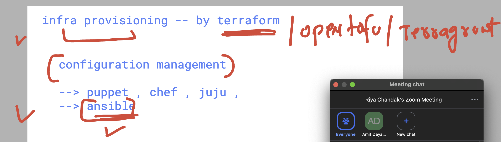
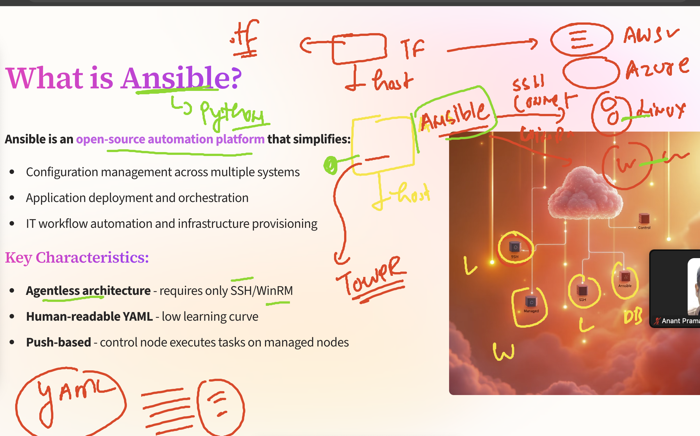
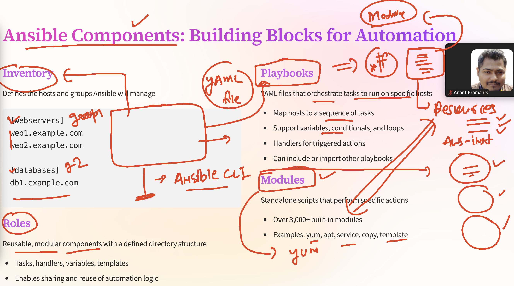
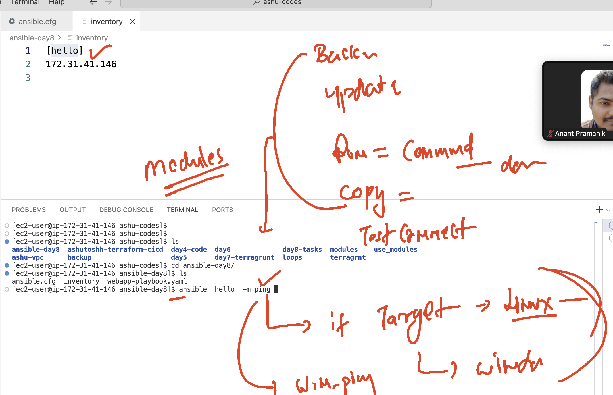
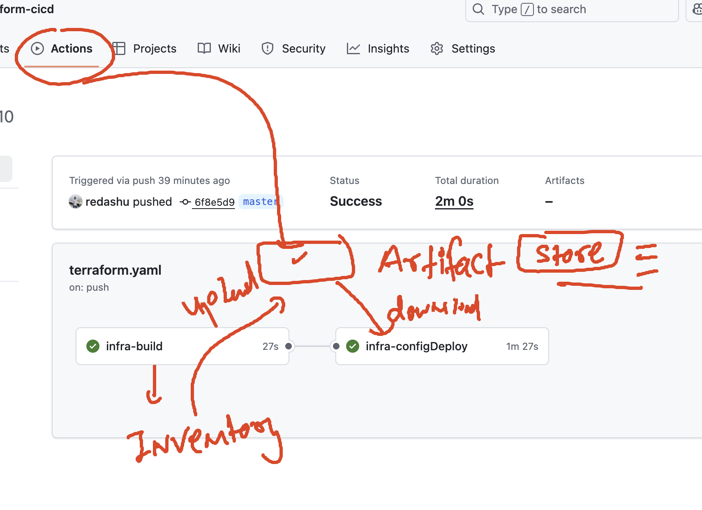
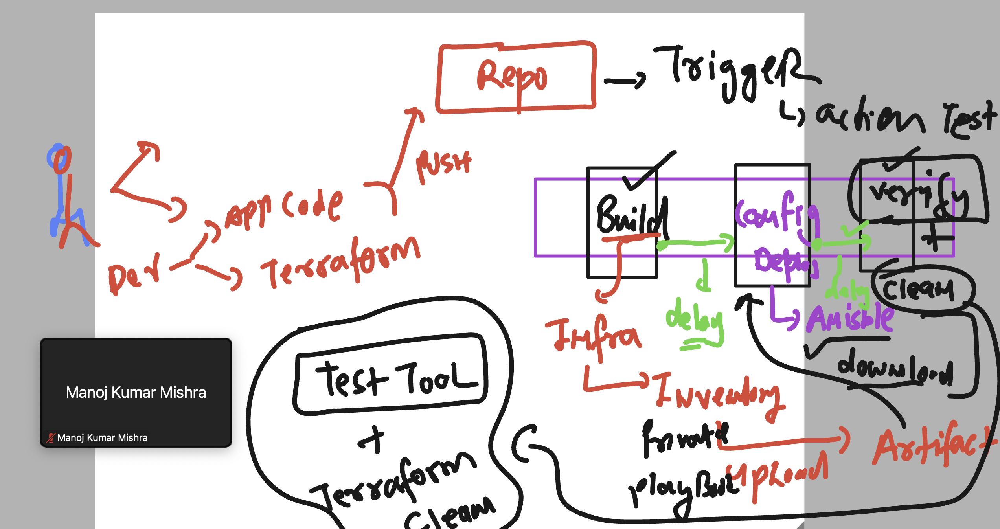

# terraform_aws_cicd25thAug2025
## quick revision about Github actions cicd 


### infra provisoning vs configuration management 



## basic info about Ansible 



### ansible components 



### doing the directory setup 

```
ec2-user@ip-172-31-41-146 ashu-codes]$ mkdir ansible-day8
[ec2-user@ip-172-31-41-146 ashu-codes]$ 
[ec2-user@ip-172-31-41-146 ashu-codes]$ ansible --version 
ansible [core 2.15.3]
  config file = None
  configured module search path = ['/home/ec2-user/.ansible/plugins/modules', '/usr/share/ansible/plugins/modules']
  ansible python module location = /usr/lib/python3.9/site-packages/ansible
  ansible collection location = /home/ec2-user/.ansible/collections:/usr/share/ansible/collections
  executable location = /usr/bin/ansible
  python version = 3.9.23 (main, Aug 11 2025, 00:00:00) [GCC 11.5.0 20240719 (Red Hat 11.5.0-5)] (/usr/bin/python3.9)
  jinja version = 3.1.4
  libyaml = True
[ec2-user@ip-172-31-41-146 ashu-codes]$ touch ansible-day8/inventory 
[ec2-user@ip-172-31-41-146 ashu-codes]$ touch ansible-day8/ansible.cfg 
[ec2-user@ip-172-31-41-146 ashu-codes]$ touch ansible-day8/webapp-playbook.yaml 
[ec2-user@ip-172-31-41-146 ashu-codes]$ tree ansible-day8/
ansible-day8/
├── ansible.cfg
├── inventory
└── webapp-playbook.yaml

0 directories, 3 files
[ec2-user@ip-172-31-41-146 ashu-codes]$ 

```

### understanding ansible CLI 



### running ping module in target to check connecting 

```
[ec2-user@ip-172-31-41-146 ansible-day8]$ ansible  hello  -m ping  -k
SSH password: 
[WARNING]: Platform linux on host 172.31.41.146 is using the discovered Python interpreter at /usr/bin/python3.9, but future installation of
another Python interpreter could change the meaning of that path. See https://docs.ansible.com/ansible-
core/2.15/reference_appendices/interpreter_discovery.html for more information.
172.31.41.146 | SUCCESS => {
    "ansible_facts": {
        "discovered_interpreter_python": "/usr/bin/python3.9"
    },
    "changed": false,
    "ping": "pong"
}

```

### listing down the module 

```
ec2-user@ip-172-31-41-146 ansible-day8]$ ansible  hello  -m command -a "date"  -k
SSH password: 
[WARNING]: Platform linux on host 172.31.41.146 is using the discovered Python interpreter at /usr/bin/python3.9, but future installation of
another Python interpreter could change the meaning of that path. See https://docs.ansible.com/ansible-
core/2.15/reference_appendices/interpreter_discovery.html for more information.
172.31.41.146 | CHANGED | rc=0 >>
Wed Sep  3 06:07:08 UTC 2025
[ec2-user@ip-172-31-41-146 ansible-day8]$ ansible-doc  -l  | grep ping 
ansible.builtin.ping                                                                             Try to connect to host, verify a usable python and re...
ansible.netcommon.net_ping                                                                       Tests reachability using ping...
ansible.windows.win_ping                                                                         A windows version of t...
cisco.ios.ios_ping                                                                               Tests reachability usin...
cisco.iosxr.iosxr_ping                                                                           Tests reachability using ...
cisco.ise.licensing_feature_to_tier_mapping_info                                                 Information module for Licensing F...
cisco.ise.sg_mapping                                                                             Resource...           
cisco.ise.sg_mapping_bulk_monitor_status_info                                                    Information module for SG Mappi...
cisco.ise.sg_mapping_bulk_request                           

```


### understanding share dynamic content between multi stage in github action 
### using artifacts 



### final thing to be done in term of automation with github action + terraform + ansible 

