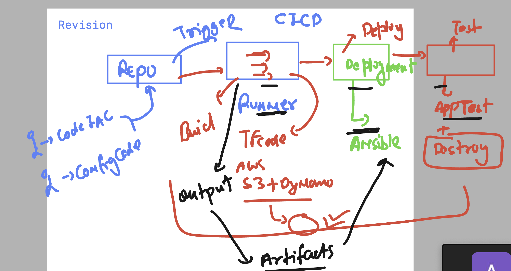
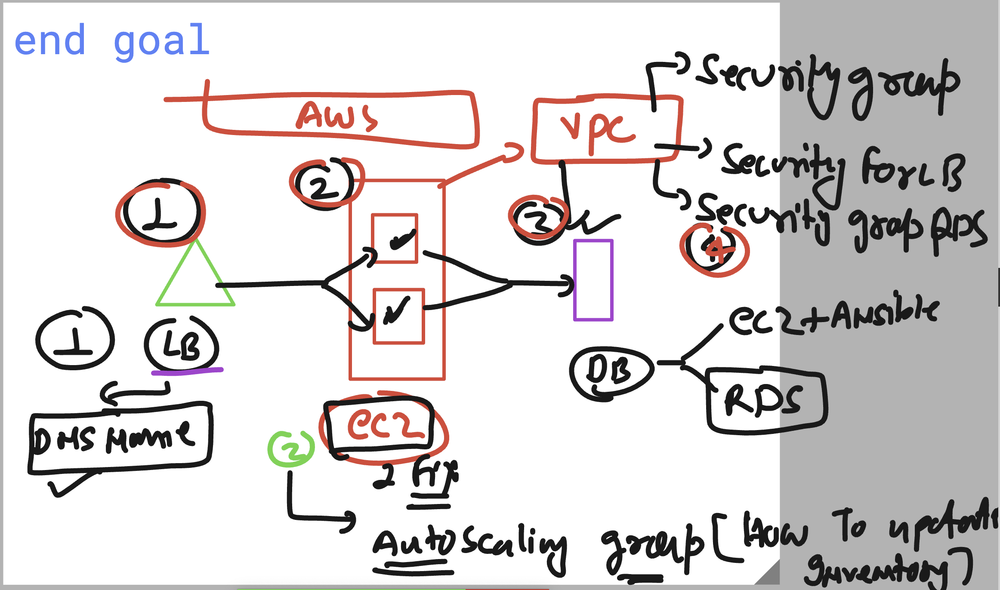
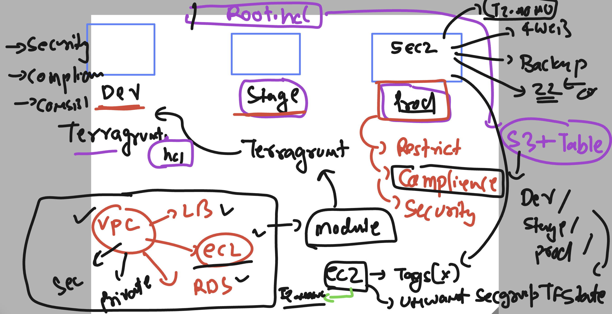
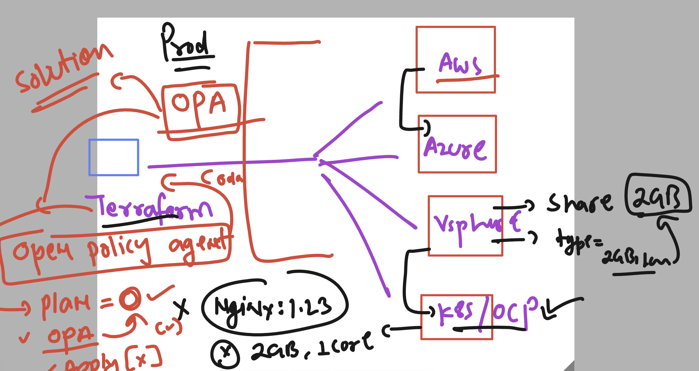

# terraform_aws_cicd25thAug2025

### Revision of terraform + ansible + github action pipeline 



### running ansible playbook 

```
ansible-playbook  webapp-playbook.yaml  --ask-pass
SSH password: 

PLAY [Setup Apache HTTPD on Amazon Linux] ****************************************************************************************************

TASK [Gathering Facts] ***********************************************************************************************************************
[WARNING]: Platform linux on host 172.31.41.146 is using the discovered Python interpreter at /usr/bin/python3.9, but future installation of
another Python interpreter could change the meaning of that path. See https://docs.ansible.com/ansible-
core/2.15/reference_appendices/interpreter_discovery.html for more information.
ok: [172.31.41.146]

TASK [Ensure Apache HTTPD is installed] ******************************************************************************************************
changed: [172.31.41.146]

TASK [Ensure Apache HTTPD service is enabled and started] ************************************************************************************
changed: [172.31.41.146]

TASK [Deploy custom index.html] **************************************************************************************************************
changed: [172.31.41.146]

PLAY RECAP ***********************************************************************************************************************************
172.31.41.146              : ok=4    changed=3    unreachable=0    failed=0    skipped=0    rescued=0    ignored=0   

[ec2-user@ip-172-31-41-146 ansible-day9]$ ls /var/www/html/
ashu1.html  index.html
[ec2-user@ip-172-31-41-146 ansible-day9]$ 

```

### project you can try it out



## Understanding Terraform + prod env related restriction 




## Understanding OPA (Open policy agent)

:- this is Policy as Code (rules that must be followed by Infra )

